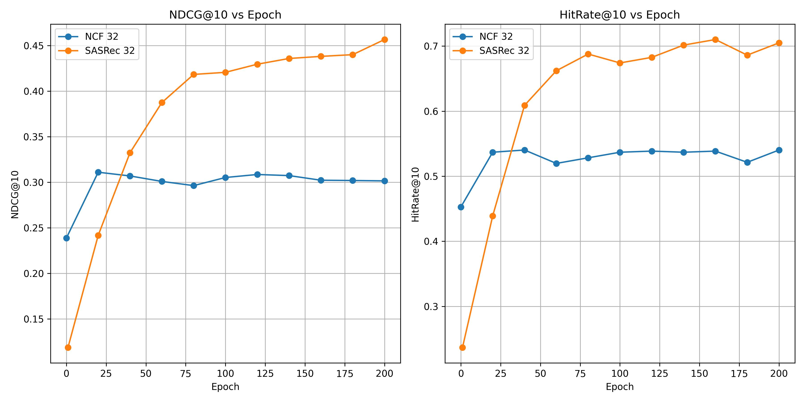
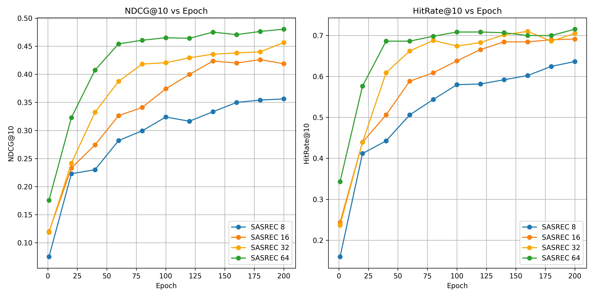

This is a fork of [SASRec-pytorch](https://github.com/pmixer/SASRec.pytorch) for educational purpose. We studied how the model works with some small modification to run it with a downsampled MovieLens-1M dataset to ~100k interactions (mlm-sample-100k) at embedding size of 8, 16, 32, 64. We also compared the result with [NCF](https://github.com/hexiangnan/neural_collaborative_filtering) using the same sampledataset but transformed to work with the model (the dataset is in NCFdata/).

Result compared with NCF


Results at different embedding size


Below is the original readme of SASRes-pytorch
---
modified based on [paper author's tensorflow implementation](https://github.com/kang205/SASRec), switching to PyTorch(v1.6) for simplicity, fixed issues like positional embedding usage etc. (making it harder to overfit, except for that, in recsys, personalization=overfitting sometimes)

to train:

```
python main.py --dataset=ml-1m --train_dir=default --maxlen=200 --dropout_rate=0.2 --device=cuda
```

just inference:

```
python main.py --device=cuda --dataset=ml-1m --train_dir=default --state_dict_path='ml-1m_default/SASRec.epoch=1000.lr=0.001.layer=2.head=1.hidden=50.maxlen=200.pth' --inference_only=true --maxlen=200

```

output for each run would be slightly random, as negative samples are randomly sampled, here's my output for two consecutive runs:

```
1st run - test (NDCG@10: 0.5897, HR@10: 0.8190)
2nd run - test (NDCG@10: 0.5918, HR@10: 0.8225)
```

pls check paper author's [repo](https://github.com/kang205/SASRec) for detailed intro and more complete README, and here's the paper bib FYI :)

```
@inproceedings{kang2018self,
  title={Self-attentive sequential recommendation},
  author={Kang, Wang-Cheng and McAuley, Julian},
  booktitle={2018 IEEE International Conference on Data Mining (ICDM)},
  pages={197--206},
  year={2018},
  organization={IEEE}
}
```

I see a dozen of citations of the repo recently🫰, here's the repo bib if needed.
```
@software{Huang_SASRec_pytorch,
author = {Huang, Zan},
title = {PyTorch implementation for SASRec},
url = {https://github.com/pmixer/SASRec.pytorch},
year={2020}
}
```
